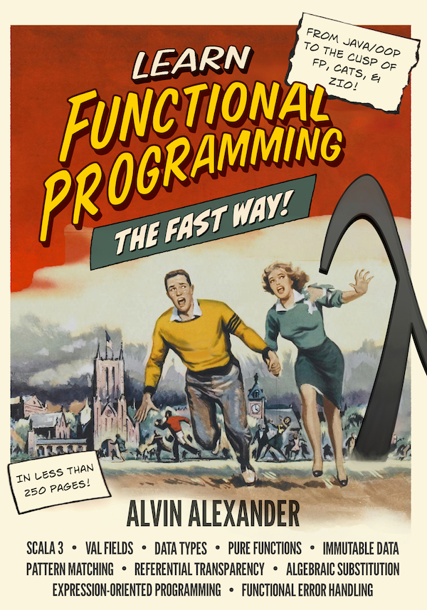

# Learn Functional Programming The Fast Way!

This is the repository for my book, “Learn Functional Programming The Fast Way!”

## Source code

- The “Word Count” source code examples are in the [WordCount](./WordCount) directory.
- The “To-Do List” source code examples are in the [ToDoList](./ToDoList) directory.
- The “ZIO” source code examples are in the [ZIO](./ZIO) directory.

## Issues

If you find any bugs/issues in the book, please [report them as issues here](https://github.com/alvinj/LearnFunctionalProgrammingBook/issues).

## Buy the book

You can buy the paperback, Kindle, and PDF versions of the book here:

- [Learn Functional Programming The Fast Way!](https://alvinalexander.com/scala/learn-functional-programming-book/)

## Book cover

And if you like book covers, here’s the new cover image:

