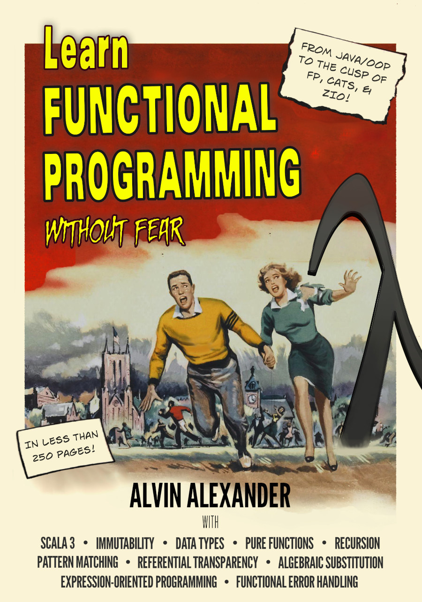

# Learn Functional Programming Without Fear (Book)

This is the repository for my book, “Learn Functional Programming Without Fear.”

## Source code

The “Word Count” source code examples are available in the [WordCount](./WordCount) directory.

## Issues

If you find any bugs/issues in the book, please [report them as issues here](https://github.com/alvinj/LearnFunctionalProgrammingBook/issues).

## Buy the book ($5)

The PDF version of the book is available for just $5 here:

- [alvinalexander.gumroad.com/l/learnfp](https://alvinalexander.gumroad.com/l/learnfp)

## Book cover

And if you like book covers, here’s the new cover image:

